# PDE-Aware Optimizer for Physics-Informed Neural Networks

**Paper:** [https://arxiv.org/abs/2507.08118](https://arxiv.org/abs/2507.08118)

<p align="center">
  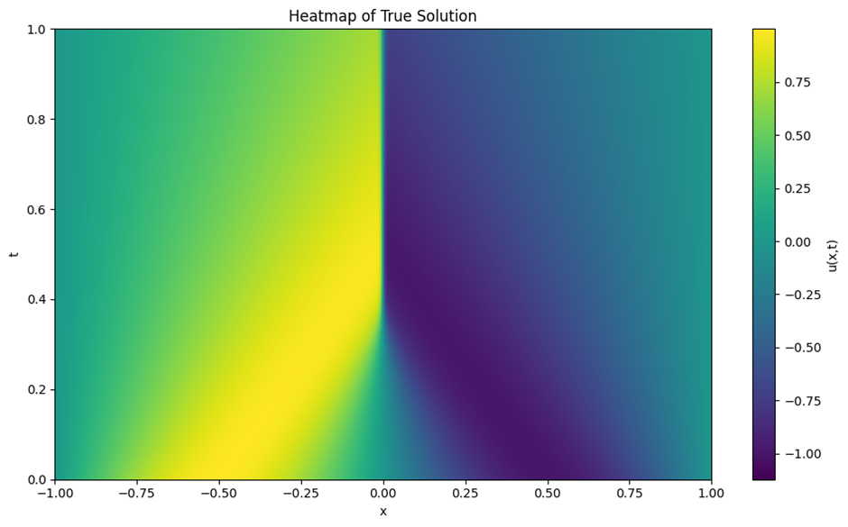
  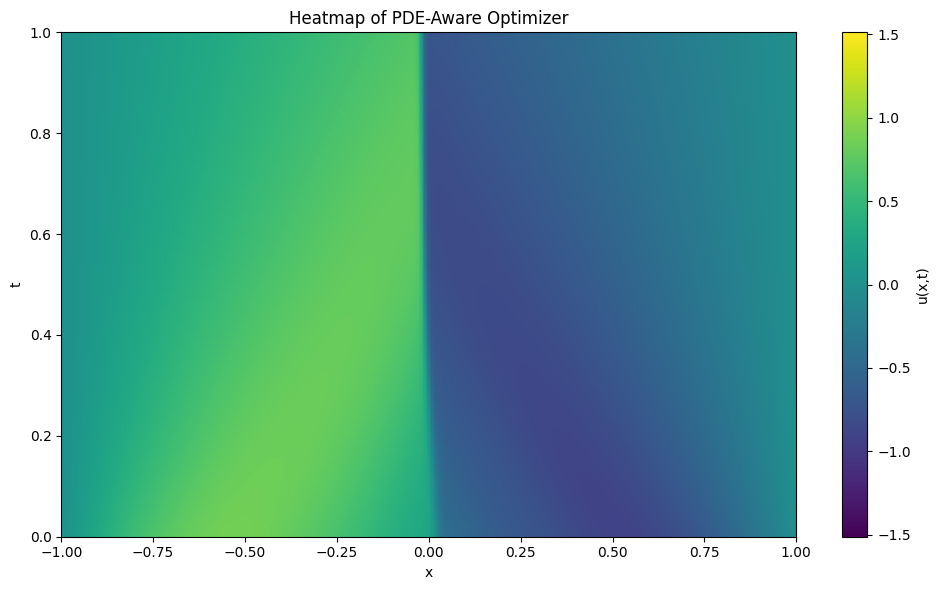
  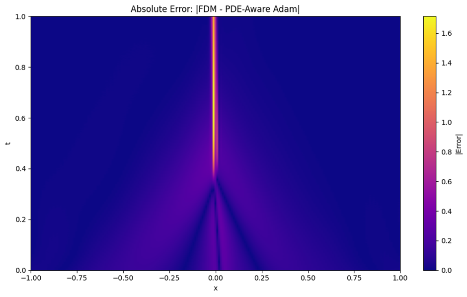
</p>

**Figure 1** – Burgers’ Equation at a glance: ground truth (left), PDE-Aware PINN prediction (center), and |error| (right).

*Note: PDE-Aware yields **more stable** training trajectories (see Figure 7) but incurs **larger absolute error** than Adam/SOAP.*

## Project Goal

Standard optimizers (e.g. Adam) treat PINN losses as black-box objectives and often oscillate or require delicate tuning on stiff PDEs.  
This project introduces a PDE-Aware Optimizer that aligns gradients from PDE-residual, boundary, and initial losses, scales steps by the variance of per-sample PDE gradients, and avoids expensive Hessian inversions for practical scalability. Our findings and extensions can be found in our paper, "[PDE-aware Optimizer for Physics-informed Neural Networks](https://arxiv.org/abs/2507.08118)".  

<p align="center">
  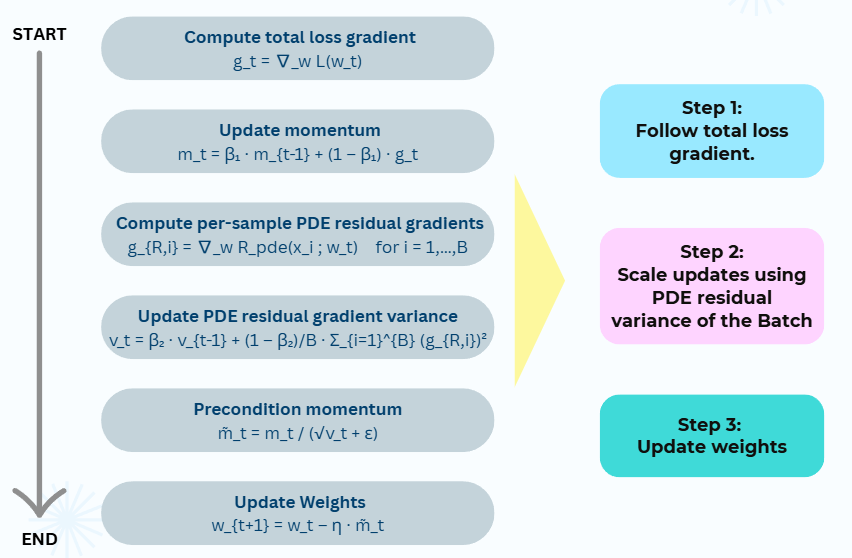
</p>

**Figure 2** – Workflow of the PDE-Aware optimizer:  
first-moment from batch-avg PDE‐residual gradients; second-moment from their element-wise variance; preconditioned update.

## Implemented Physics Problems

We benchmark on three 1D PDEs over $(x,t) \in [-1,1] \times [0,1]$.

### Burgers’ Equation

<p align="center">
  
  
  
</p>

**Figure 3** – Burgers’: true (left), PDE-Aware (center), |error| (right).

<p align="center">
  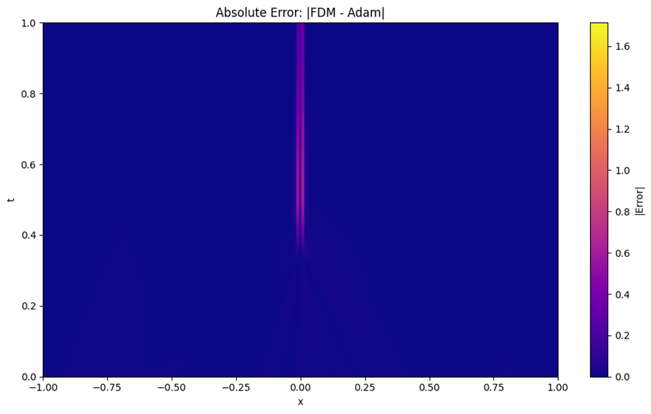
  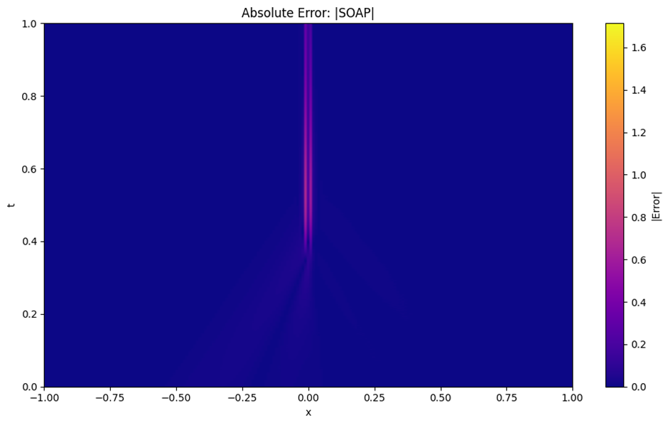
  
</p>
**Figure 4** – Absolute-error heatmaps: Adam (left), SOAP (center), PDE-Aware (right).  
*PDE-Aware’s error magnitude is higher but more uniformly distributed.*

### Allen–Cahn Equation

<p align="center">
  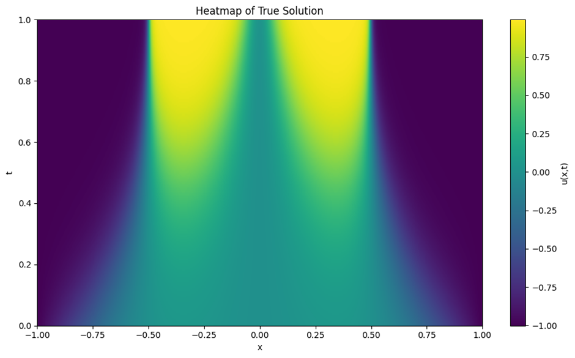
  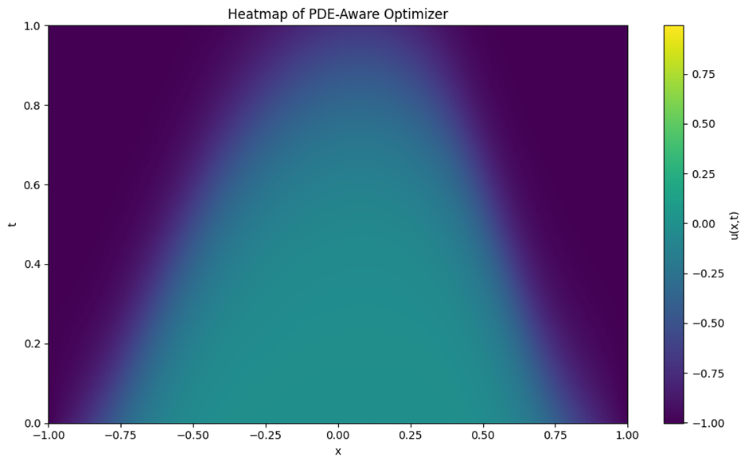
  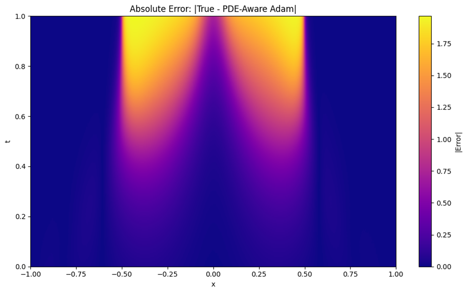
</p>
**Figure 5** – Allen–Cahn: true (left), PDE-Aware (center), |error| (right).

<p align="center">
  
  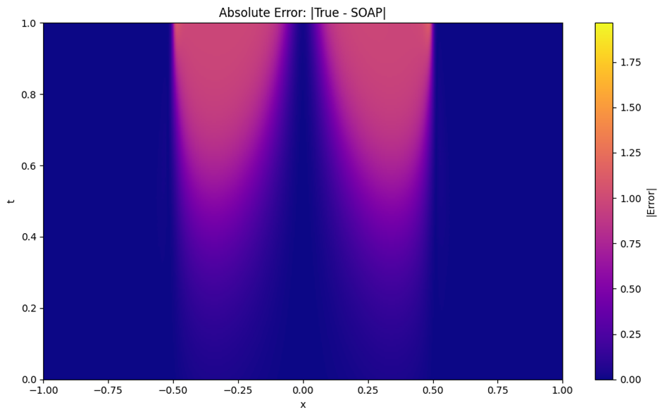
  
</p>

**Figure 6** – Absolute-error heatmaps: Adam, SOAP, PDE-Aware.

> **Note:** Results on the KdV equation follow the same pattern—figures available in `/figures/kdv_*`.

## How It Works

1. **PINN Architecture**  
   A 3×64-neuron MLP with `tanh` activations approximates the solution $u_\theta(x, t)$.
2. **Loss Composition**

   We form a composite loss:
   $$
   \mathcal{L} = \mathcal{L}_{ic} + \mathcal{L}_{bc} + \mathcal{L}_{r}
   $$
    - $\mathcal{L}_{ic}$: initial-condition loss
    - $\mathcal{L}_{bc}$: boundary-condition loss
    - $\mathcal{L}_{r}$ : PDE-residual loss
3. **PDE-Aware Update**  
At each step we compute:
    
     (1) First moment (mean of batch PDE-residual gradients)
    $$
    m_t = \beta_1 m_{t-1} + (1 - \beta_1) \bar{g}
    $$

     (2) Second moment (variance of per-sample PDE gradients)
    $$
    v_t = \beta_2 v_{t-1} + \frac{1 - \beta_2}{B} \sum_{i=1}^{B} g_i \odot g_i
    $$

     (3) Preconditioned parameter update
    $$
    w_{t+1} = w_t - \eta \frac{m_t}{\sqrt{v_t} + \epsilon}
    $$

<p align="center">
  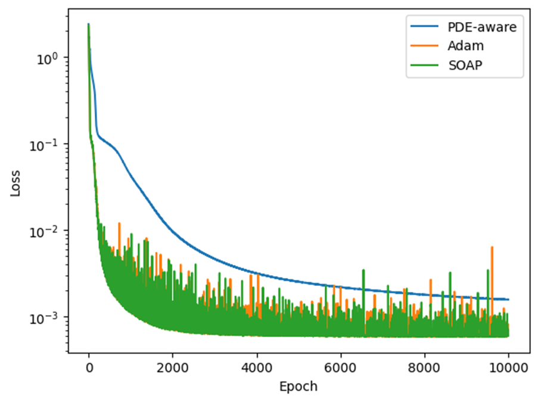
</p>

**Figure 7** – Training loss vs. epochs (sample plot): PDE-Aware (blue) converges **smoothly**, while Adam (orange) and SOAP (green) converge faster but **oscillate**.  
*Similar stability observed on Burgers (see `burgers_equation_training_loss_vs_epochs.png`) and KdV.*

## Key Takeaways

- **Stability > Speed**  
  PDE-Aware trades slightly higher steady-state error for dramatically improved convergence smoothness.  
- **Avoids Hessians**  
  Leverages first-order variance statistics for second-order–like preconditioning at low cost.  
- **Plug & Play**  
  Drop into any PINN codebase with minimal changes.

## Technologies

- **JAX** (autograd + JIT)  
- **NumPy / SciPy** for data & numerics  
- **Matplotlib** for heatmaps & diagnostics  

## Usage

Ensure `.mat` files (e.g., `burgers.mat`) are placed in `PDE-aware-optimzer-jax/data/`.

Run training with:

```bash
python main.py --pde burgers --model basic
python main.py --pde allen_cahn --model basic
python main.py --pde kdv --model basic
```

After training, error heatmaps are saved in the `figures/` directory:

```
figures/<pde>_<optimizer>_error.png
```
---